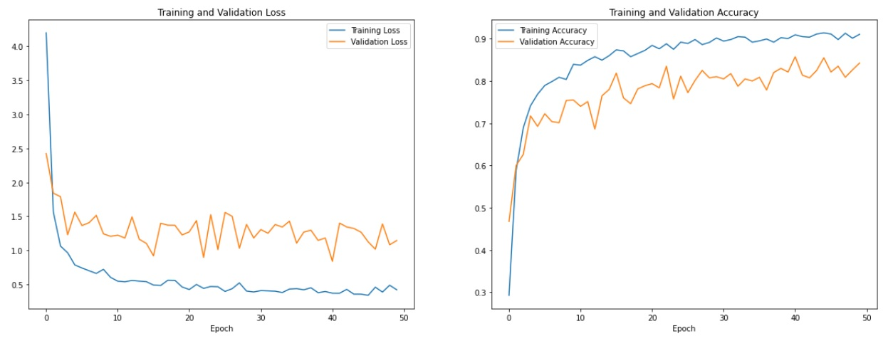

# VGG16 on the Fruits-360 Dataset

## Introduction

The reuse of a previously trained model on a new problem is known as transfer learning. It is particularly popular in deep learning right now since it can train deep neural networks with a small amount of data. Some of the popular pre-trained models are currently VGGs and ResNets. To get desired outputs from these pre-trained models, fine-tuning techniques need to be applied. These are famous transfer learning techniques for deep neural networks, where a few rounds of training are applied to the parameters of a pre-trained model to adapt them to a new task. Also, transfer learning is a quite suitable method for image classification because the low- and middle-layer features of images are almost the same. In this repository, we are going to try to predict the fruits in the Fruits-360 dataset by using the VGG16 model (You can examine the VGG16 architecture from the image below). To do this, we will use a VGG16 model on the Fruits-360 dataset, and we will change the last layer of the model to get the desired outputs.

 ## Results
 
 We trained the VGG model for our dataset by changing the last fully connected layer, and here is the results:
 
 

When looking at the graphs, it seems that the model can predict an image in the Fruits-360 dataset with around 85%  accuracy. Also, a small overfitting problem has occurred, but since the model has already been trained with the ImageNet dataset and we trained only the last layer, it is quite normal.

To see the code and get more information about the model, you can examine "transfer_learning_vgg16.ipynb"

## Sources

* **Dataset**: https://www.kaggle.com/datasets/moltean/fruits
* **Useful Links**:
  * https://www.learndatasci.com/tutorials/hands-on-transfer-learning-keras/
  * https://medium.com/@mygreatlearning/everything-you-need-to-know-about-vgg16-7315defb5918
